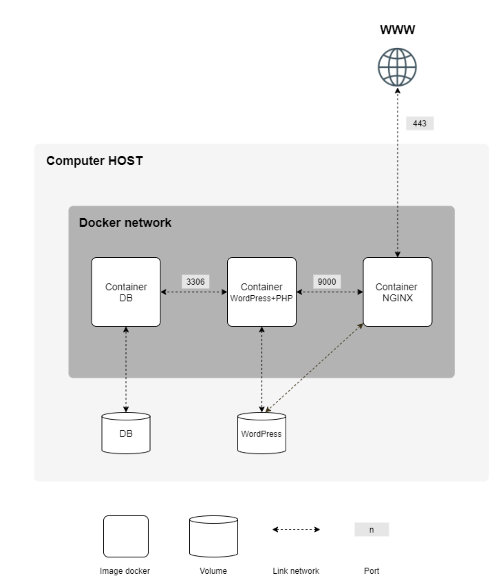

# docker_project

## Overview

This project sets up a WordPress website with a MariaDB database backend and an Nginx web server using Docker. Each component runs in its own container, providing a modular and isolated environment. The setup ensures secure and efficient operation with persistent data storage. You can also check the comments in the files to get additional information.

## Diagram



## Concepts

### Docker
Docker is a platform for developing, shipping, and running applications in containers. Containers package the application with its dependencies, ensuring consistency across different environments.

### Docker Compose
Docker Compose is a tool for defining and running multi-container Docker applications using a `docker-compose.yml` file to configure the services.

### PHP-FPM
PHP-FPM (FastCGI Process Manager) is an alternative PHP FastCGI implementation with additional features for managing high-traffic websites. It provides advanced process management, slow log, and adaptive process spawning.

### FastCGI
FastCGI is a protocol for interfacing interactive programs with a web server. It keeps processes alive to handle multiple requests, reducing the overhead associated with starting new processes.

## Project Structure

```
.
|-- Makefile
`-- srcs
    |-- docker-compose.yml
    |-- .env
    `-- requirements
        |-- mariadb
        |   |-- conf
        |   |   `-- 50-server.cnf
        |   |-- Dockerfile
        |   `-- tools
        |       `-- initial_db.sql
        |-- nginx
        |   |-- conf
        |   |   `-- default
        |   |-- Dockerfile
        |   `-- tools
        |       `-- nginx_start.sh
        `-- wordpress
            |-- conf
            |   `-- www.conf
            |-- Dockerfile
            `-- tools
                |-- wordpress_start.sh
                `-- wp-config.php
```

## Setup and Usage

### Prerequisites
- Docker
- Docker Compose

### Commands

- **Build and Start Services**: 
  ```sh
  make all
  ```

- **Stop Services**: 
  ```sh
  make down
  ```

- **Rebuild and Restart Services**: 
  ```sh
  make re
  ```

- **Clean Up**: 
  ```sh
  make clean
  ```

## Configuration Files

### `docker-compose.yml`
Defines the services (MariaDB, WordPress, Nginx), networks, and volumes.

### `.env`
Contains environment variables for WordPress configuration (e.g., site URL, admin credentials).

### MariaDB
- **`50-server.cnf`**: Custom MariaDB configuration.
- **`initial_db.sql`**: SQL script for database initialization.
- **`Dockerfile`**: Defines the MariaDB image build process.

### WordPress
- **`www.conf`**: PHP-FPM configuration.
- **`wordpress_start.sh`**: Startup script to set up WordPress.
- **`wp-config.php`**: WordPress configuration file.
- **`Dockerfile`**: Defines the WordPress image build process.

### Nginx
- **`default`**: Nginx configuration file for serving WordPress with SSL.
- **`nginx_start.sh`**: Startup script to generate SSL certificates.
- **`Dockerfile`**: Defines the Nginx image build process.

## Accessing the Site

Once the services are up, access the WordPress site at:

```sh
https://<your-domain>
```

or you can use curl


